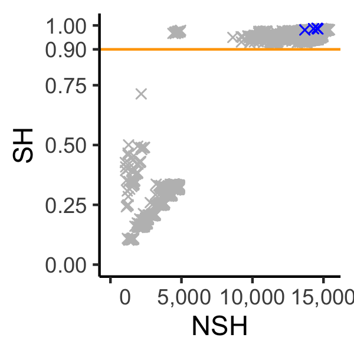
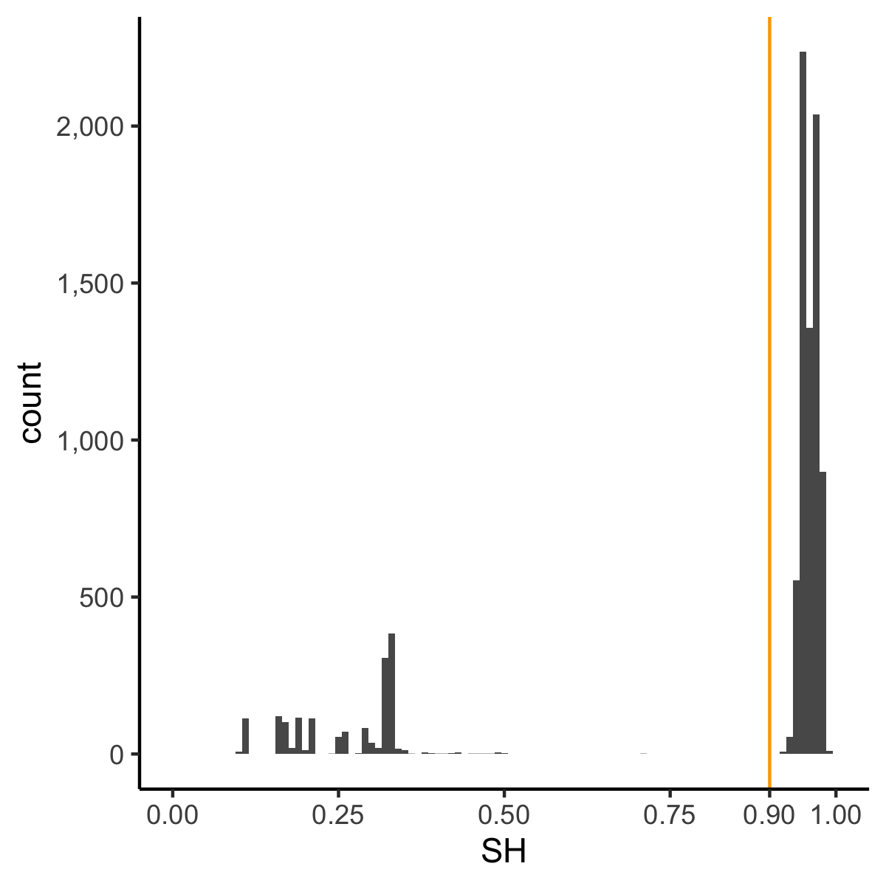

# Detecting clonemate pairs based on "Shared Heterozygosity(SH)" and technical replicates
## 1. Requirements
* A vcf file containing bi-allelic SNPs
* [SH_pair.py](SH_pair.py)
## 2. Example dataset
        data/all.vcf
This file includes 18,021 bi-allelic SNPs for 133 individuals, including four technical replicates (coded a & b at the end of sample names).  
(Edgeloe, Jane M., et al. "Extensive polyploid clonality was a successful strategy for seagrass to expand into a newly submerged environment." Proceedings of the Royal Society B 289.1976 (2022): 20220538.)
## 3. Generating a bash script for all combinations of two samples
        ./generateAllPairs.py /path/to/SH_pair.py path/to/vcf
For example:

        ./generateAllPairs.py ./SH_pair.py ./data/all.vcf

The output is: [allPairs.sh](output/allPairs.sh)

## 4. Calculating pairwise SH indices

        ./SH_pair.py /path/to/vcf sampleX1 sampleX2 /path/to/output

For example:

        ./SH_pair.py ./data/all.vcf DH12 DH15 DH12_DH15_SH.txt

The output is: [DH12_DH15_SH.txt](output/DH12_DH15_SH.txt)

For two samples (X1 and X2) in multicellular diploid clonal species, NSH(X1, X2) denotes the number of the SNPs where two samples are identically heterozygous; NHet(Xn) denotes the number of the heterozygous loci in Xn.  
SH(X1) = NSH(X1, X2)/NHet(X1)  
SH(X2) = NSH(X1, X2)/NHet(X2)  
SH = min(SH(X1), SH(X2))  

## 5. Combining the results of all sample pairs

        cat output/DH12_DH15_SH.txt | awk 'NR==1' >header.txt
        cat *_SH.txt | awk '!/^X1/' >contents.txt
        cat header.txt contents.txt >combine.txt

Adding one column showing the information of technical replicates: [SH_indices.txt](output/SH_indices.txt).

## 6. Identifying clonemate pairs based on SH
Making plots using "ggplot2" package in R: [plot.R](plot.R).

        Rscript plot.R

Each data point represents one sample pair, and technical replicates are marked in blue.  
Samples pairs vertically close to the technical replicates represent clonemates.

If technical replicates are not available, a threshold can be set to the valley of the histogram. The peak close to SH=1 represents clonemates.
